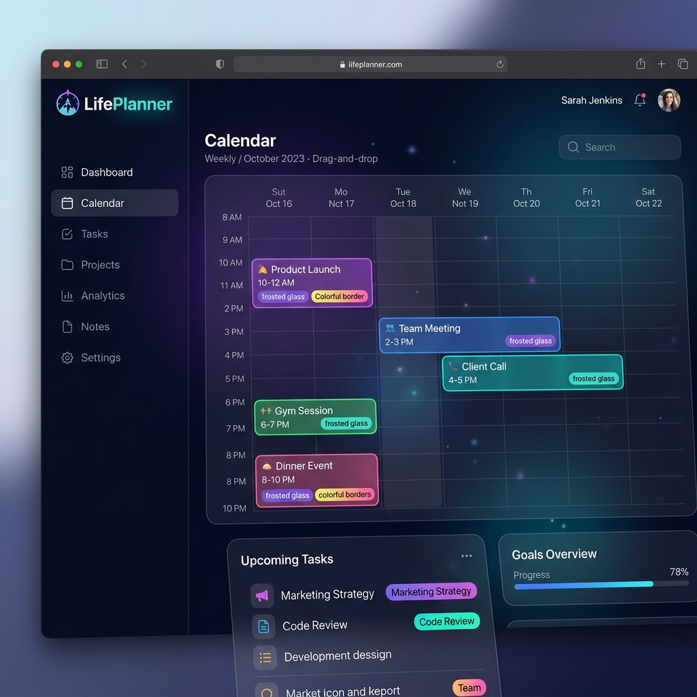

# 🌌 LifePlanner

[](https://angular.io/)
[](https://dotnet.microsoft.com/)
[](https://www.sqlite.org/)
[](https://opensource.org/licenses/MIT)

> **LifePlanner** is a premium, high-performance life management system designed with a stunning **Midnight Glass** aesthetic. Organize your days, track your goals, and manage your life with fluid drag-and-drop interactions and real-time synchronization.



---

## ✨ Key Features

- 🧊 **Midnight Glass UI**: A beautiful, modern interface featuring frosted glass effects, vibrant gradients, and smooth animations.
- 🎯 **Dynamic Planning**: Intuitive drag-and-drop calendar interface for effortless task organization.
- 🔐 **Secure Authentication**: Seamless integration with Google Identity Services for secure and quick login.
- 🔄 **Real-time Sync**: End-to-end integration between the Angular frontend and .NET backend ensures your data is always up to date.
- 🏷️ **Category Management**: Organize your life into customizable categories with distinct visual identities.
- 📱 **Responsive Design**: Designed to feel premium across all devices.

---

## 🛠️ Tech Stack

### Frontend
- **Framework**: Angular 19+
- **Styling**: Vanilla CSS with Glassmorphism principles
- **State Management**: Service-based architecture with RxJS
- **Interactions**: Angular CDK Drag and Drop
- **Auth**: Google One Tap / ID Token Validation

### Backend
- **Core**: .NET 10 Minimal APIs
- **ORM**: Entity Framework Core
- **Database**: SQLite
- **Security**: JWT-based authentication & Google Token Validation

---

## 🏗️ Architecture

LifePlanner follows a strict **Smart/Dumb Component** architecture:
- **Dumb Components**: Focused purely on UI/UX, receiving data via `@Input()` and emitting events via `@Output()`.
- **Smart Components**: Handle domain logic, interact with services, and manage state.
- **Services**: All business logic and API interactions are encapsulated in Angular `@Injectable` classes.

---

## 🚀 Getting Started

### Prerequisites
- [Node.js](https://nodejs.org/) (LTS)
- [.NET 10 SDK](https://dotnet.microsoft.com/download/dotnet/10.0)
- [Angular CLI](https://angular.io/cli)

### Setup & Installation

1. **Clone the repository**
   ```bash
   git clone https://github.com/LasseAndresen/LifePlanner.git
   cd LifePlanner
   ```

2. **Backend Setup**
   ```bash
   cd server
   dotnet restore
   dotnet ef database update
   dotnet run
   ```

3. **Frontend Setup**
   ```bash
   cd client
   npm install
   ng serve
   ```

4. **Launch**
   Open your browser at `http://localhost:4200` to start planning your life.

---

## 🎨 Design Philosophy

LifePlanner isn't just a tool; it's an experience. The **Midnight Glass** design focuses on:
- **Depth**: Using shadows and translucency to create a layered workspace.
- **Focus**: Subtle micro-animations to guide user attention.
- **Premium Feel**: Carefully curated HSL color palettes and modern typography (Inter/Outfit).

---

## 📝 License

Distributed under the MIT License. See `LICENSE` for more information.

---

<p align="center">
  Built with ❤️ by Lasse Andresen
</p>
